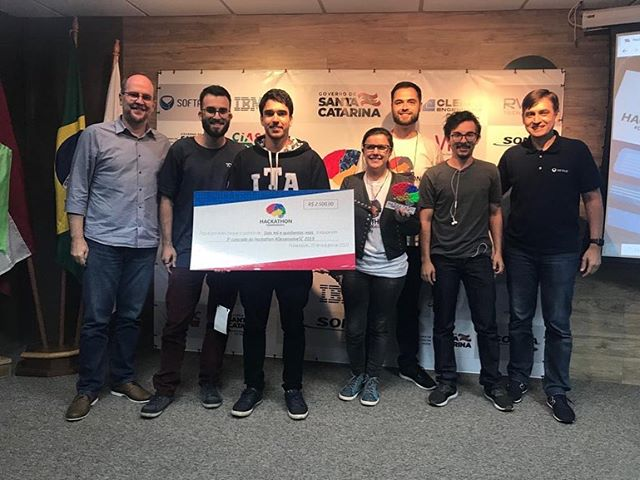

# ChatSUS - Chatbot para redução do absenteísmo
Solução apresentada no Hackathon DesenvolveSC, CIASC, 2019

## About

O absenteísmo na saúde é a falta a consultas e outros procedimentos agendados no SUS. Essas faltas geram prejuízos de milhões de reais. 

O projeto focou em um segmento que engloba cerca de 64% dos pacientes faltantes e o objetivo é aumentar os canais de comunicação através de aplicativos que os usuários já utilizam como Whatsapp ou Telegram, e assim manter o paciente sempre atento e consciente para que não falte ou pelo menos cancele a tempo para que outra pessoa possa ser agendada.

O sistema utiliza IA e informações das listas de espera do SUS para guiar a conversa entre o paciente e o sistema desde o momento do agendamento até a conclusão do procedimento, recolhendo também o feedback do paciente repassando os dados para o gestor.

O código disponível neste repositório consiste apenas da parte Open Source do projeto. A propriedade intelectual completa está na posse do CIASC e do Governo do Estado de Santa Catarina.

## Features

- [Telegram Chatbot](https://github.com/canokaue/ChatSUS/tree/master/telegram_bot).
- [Tensorflow model](https://github.com/canokaue/ChatSUS/tree/master/tf_sentmentanalysis).
- [Tableau Dashboard](https://canokaue.github.io/ChatSUS/dashboard/index.html).
- [Demo Website](https://canokaue.github.io/ChatSUS/).

## Credits 

Equipe:

- [Claudio Vilas Boas](https://github.com/claudiovb).

- [André Schilichting](https://github.com/alucassch).

- [Maika Milezzi](https://www.linkedin.com/in/maikamilezzi/).

- [André Ritter](https://www.linkedin.com/in/andr%C3%A9-ritter-bastos-9a1373160/).

## License

MIT

Copyright 2019 Kaue Cano, Claudio Vilas Boas, André Schlichting, André Ritter, Maika Milezzi

Permission is hereby granted, free of charge, to any person obtaining a copy of this software and associated documentation files (the "Software"), to deal in the Software without restriction, including without limitation the rights to use, copy, modify, merge, publish, distribute, sublicense, and/or sell copies of the Software, and to permit persons to whom the Software is furnished to do so, subject to the following conditions:

The above copyright notice and this permission notice shall be included in all copies or substantial portions of the Software.

THE SOFTWARE IS PROVIDED "AS IS", WITHOUT WARRANTY OF ANY KIND, EXPRESS OR IMPLIED, INCLUDING BUT NOT LIMITED TO THE WARRANTIES OF MERCHANTABILITY, FITNESS FOR A PARTICULAR PURPOSE AND NONINFRINGEMENT. IN NO EVENT SHALL THE AUTHORS OR COPYRIGHT HOLDERS BE LIABLE FOR ANY CLAIM, DAMAGES OR OTHER LIABILITY, WHETHER IN AN ACTION OF CONTRACT, TORT OR OTHERWISE, ARISING FROM, OUT OF OR IN CONNECTION WITH THE SOFTWARE OR THE USE OR OTHER DEALINGS IN THE SOFTWARE.

